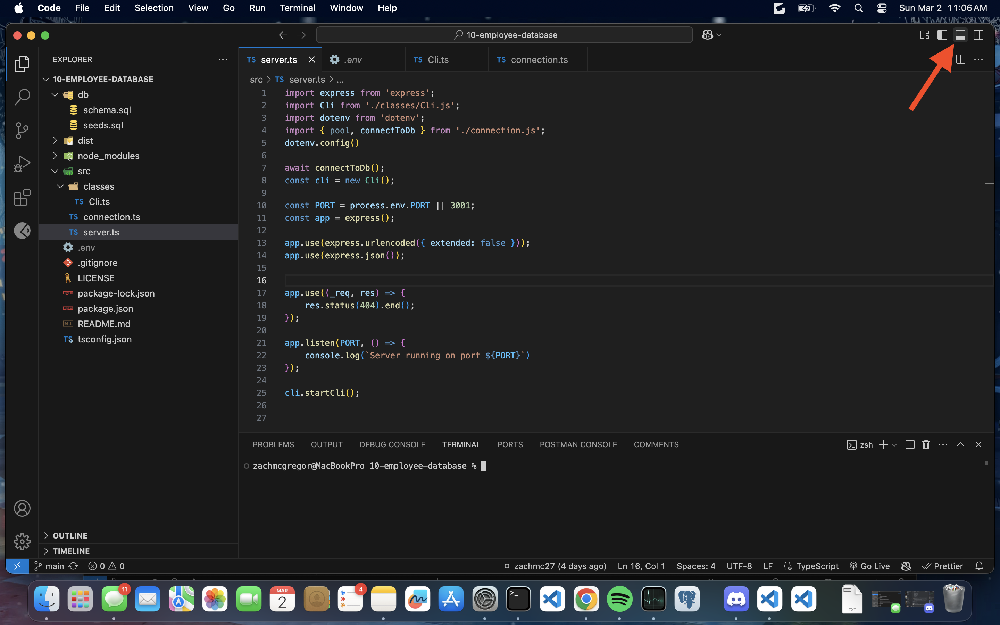

  # Employee Database Manager
  
  
  
  ## About

  The Employee Database Manager is a backend application that allows users to store data about their company and also allows users to use that data in their code by utilizing backend technologies and the database platform PostgreSQL. A user can store and configure information about employees, their salaries, roles, and departments.
   

   
  ## Table of Contents 
  - [Installation](#installation)
  - [Usage](#usage)
  - [Contributing](#contributing)
  - [Tests](#tests)
  - [License](#license)
  - [Questions](#questions)
   

   
  ## Installation
   
  Here are the prerequisites necessary to use the project:
   
  1. Nodejs
2. NPM
3. PostgreSQL

  
  To get started with the project, follow these steps:
   
  1. Visit nodes website [here](https://nodejs.org/en/download) to download NodeJS.
2. Open the terminal in your code editor and run the code ` node -v ` to check if node has been installed.
3. NPM should be automatically installed alongside node. To make sure, run the code ` npm -v ` in the terminal.
4. NPM  is used to install all required dependencie, simply run the code ` npm i ` in the terminal, and they will be installed.
5. In order to install PostgreSQL, please refer to this [blog post.](https://coding-boot-camp.github.io/full-stack/postgresql/postgresql-installation-guide)

   

   
  ## Usage 
   
  Here are the steps to start the application:
   
  1. Open an integrated terminal by clicking the box shown below: 

   
  *via VSCode*
  
2. Run the code ` npm start ` in the terminal

  
  To use the application, do the following:

  Once the application is started, you will see a menu of options for viewing and configuring the database. Maneuver through this menu using the arrow keys on your keyboard and press enter when the desired option is highlighted.
  
  You can simply choose to view respective data about employees, roles, and departments in tabular format; and you can also add update and delete data from these tables. If you choose to do so, you will be prompted with more questions about what data you would like to change.
  
  **Please refer to this video tutorial for more information about starting and operating the application**: [Employee Database Manager Tutorial](https://drive.google.com/file/d/1UTK8lSaHxcNdzLuJqy-N9EqfvMlYpPBN/view?usp=sharing) 
    
  ## Contributing
   
  Any contributions are appreciated as they are vital to the improvement and wellbeing of the project.

  If you would like to contribute, please follow these steps:

  1. **Fork the repository** to your own github account
2. **Clone the forked repository** to your local machine
3. **Create a branch** for your changes
4. **Make your changes**, while ensuring they follow the project’s standards
5. **Test your changes** to verify they work
6. **Commit your changes** with a descriptive commit message
7. **Push the changes** to your forked repository
8. **Submit a pull request** from your branch to the main repository with a detailed description of the changes and any potential issues.
9. **Be responsive to feedback** and make any updates necessary.

   

   
  ## Tests
   
  In order to run tests on the project, do the following:
   
  *Tests are not yet available for this project*
   

   
  ## License 
   
  This application is covered under the MIT License. For more information, view the official documentation [here](https://opensource.org/license/MIT).
   

   
  ## Questions
   
  For any questions or assistance, please reach out through these mediums:
   
  - **Github:** [zachmc27](https://github.com/zachmc27)
  - **Email:** <dzdudes1213@gmail.com>

  